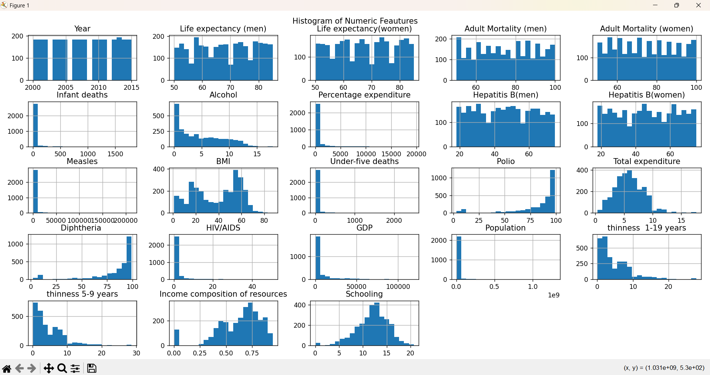
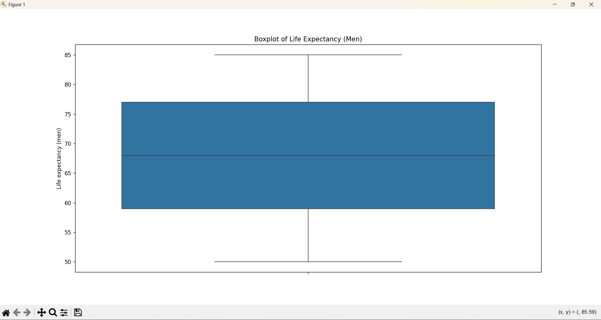
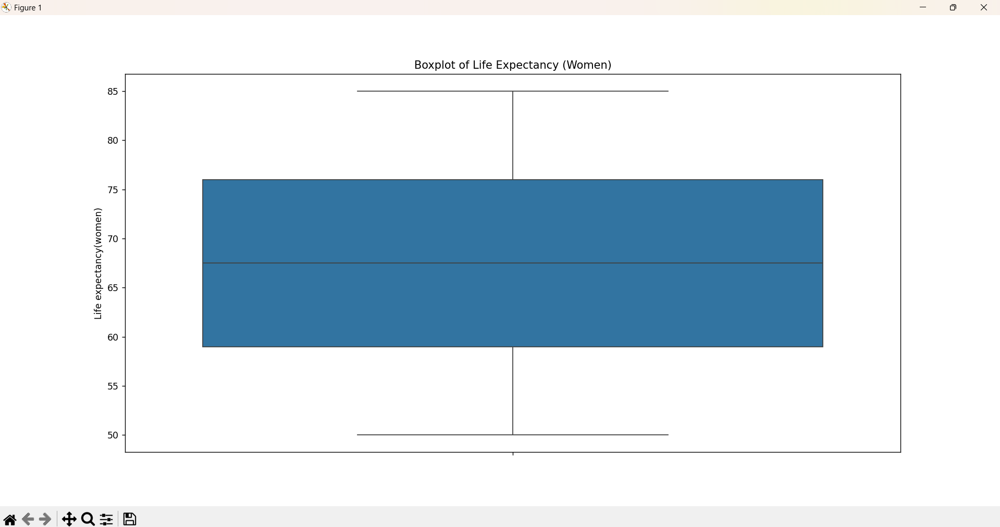
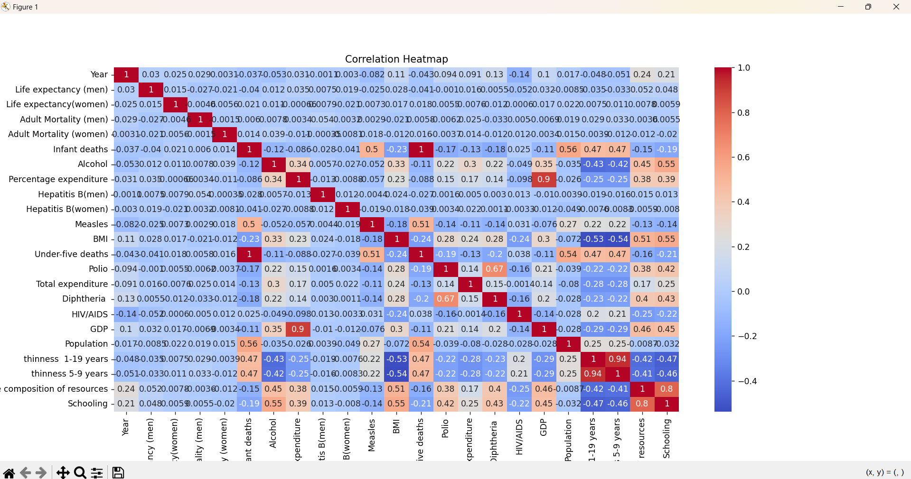
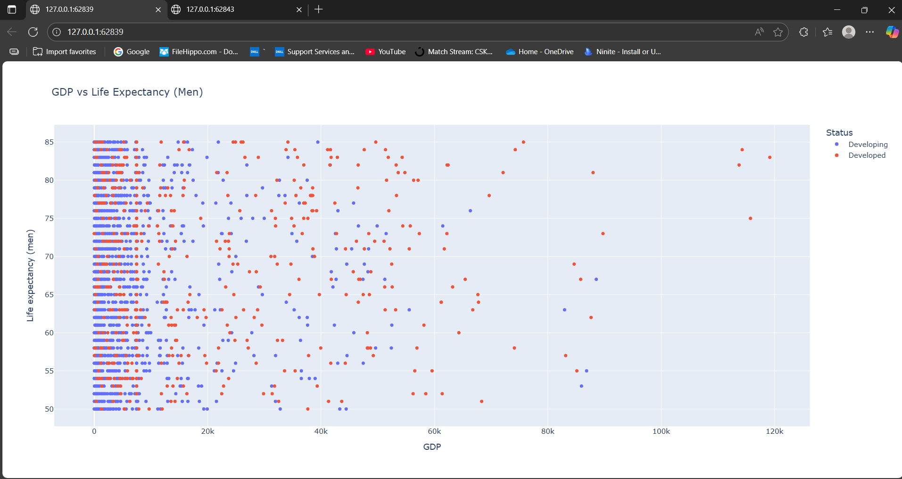
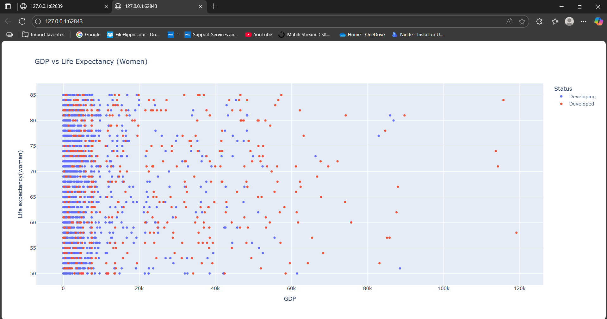
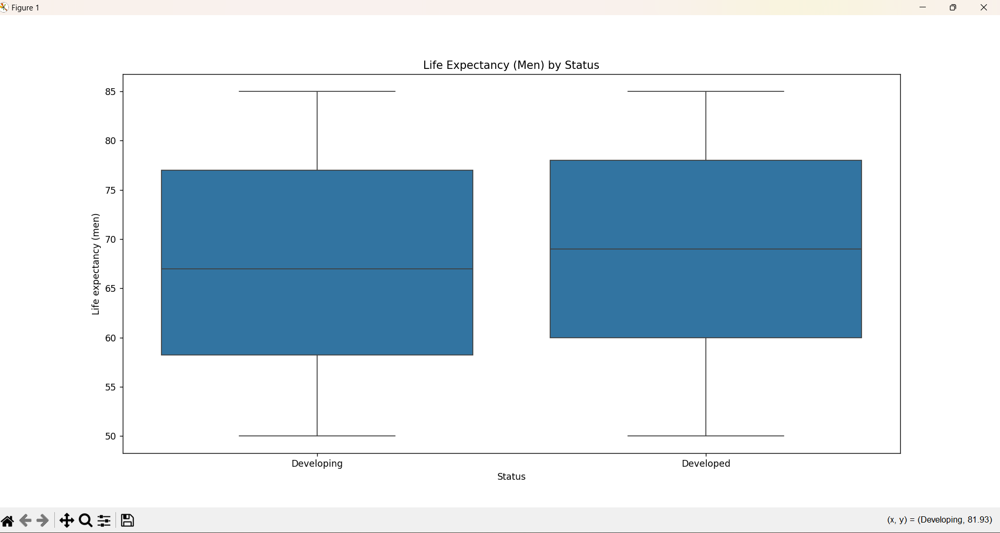
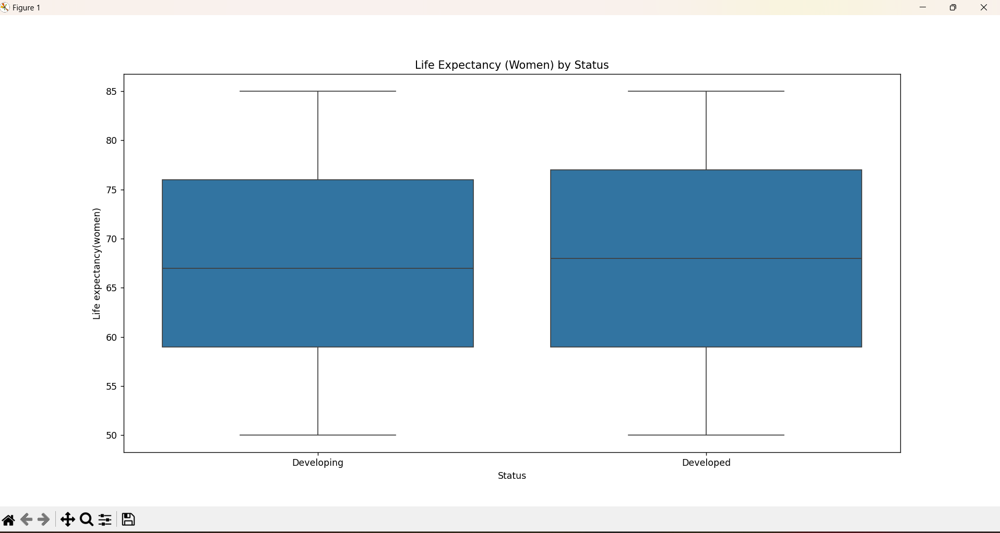

# Task 2: Exploratory Data Analysis (EDA)


This project analyzes the "Life Expectancy Data v2.csv" dataset using Python libraries such as Pandas, Matplotlib, Seaborn, and Plotly. The goal is to understand trends and patterns in life expectancy across different countries, genders, and economic statuses.

---

## Dataset

The dataset contains life expectancy information for men and women, GDP, country status (Developed or Developing), and other health and economic indicators. Some values may be missing and are handled in the analysis.

The dataset used in this project is available on Kaggle:  
[Life Expectancy Data (WHO) - Kaggle](https://www.kaggle.com/datasets/maryalebron/life-expectancy-data)


---

## Objectives

- Explore the structure and basic statistics of the dataset
- Handle missing values
- Visualize data distribution using histograms and boxplots
- Analyze correlations between numerical features
- Explore the relationship between GDP and life expectancy
- Compare life expectancy based on country status (Developed vs Developing)

---

## Steps Performed

### 1. Data Loading

Loaded the dataset using Pandas and printed:
- First few rows
- Shape of the dataset
- Column data types and null values

### 2. Missing Value Handling

Filled missing values in numeric columns using the column mean.

---

## Visualizations

### 3. Histograms of Numeric Features

Histograms help us understand how each numeric feature is distributed — whether values are spread evenly or concentrated in a specific range.




---

### 4. Boxplots of Life Expectancy

Boxplots are used to detect outliers and see the spread of life expectancy for men and women.


## Boxplot: Life Expectancy (Men)





## Life Expectancy (Women) - Boxplot

This boxplot shows the spread and outliers of life expectancy for women across different countries. It helps identify how the data is distributed and whether there are any extreme values.


---

### 5. Correlation Heatmap

The heatmap helps identify which features are strongly related to each other. For example, life expectancy may correlate with GDP or other health-related factors.



---

### 6. GDP vs Life Expectancy (Scatter Plots)

Scatter plots show the relationship between GDP and life expectancy. Countries are colored by their development status.

#### Men



#### Women


---

### 7. Life Expectancy by Status

These boxplots show the difference in life expectancy between Developed and Developing countries.

#### Men by Status


#### Women by Status


---

## Libraries Used

- `pandas` – for data loading and manipulation
- `matplotlib` – for basic plotting
- `seaborn` – for statistical plots (boxplots, heatmaps)
- `plotly.express` – for interactive visualizations (scatter plots)

---

## How to Run

1. Make sure the dataset file `Life Expectancy Data v2.csv` is in the same folder as the Python script.
2. Save the generated plots as `.png` files inside an `images/` folder.
3. Install the required libraries (if not already installed):
   ```bash
   pip install pandas matplotlib seaborn plotly

